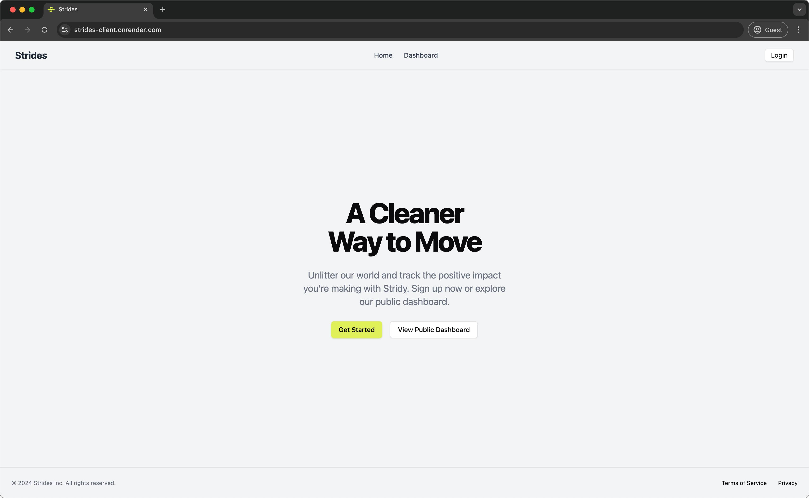
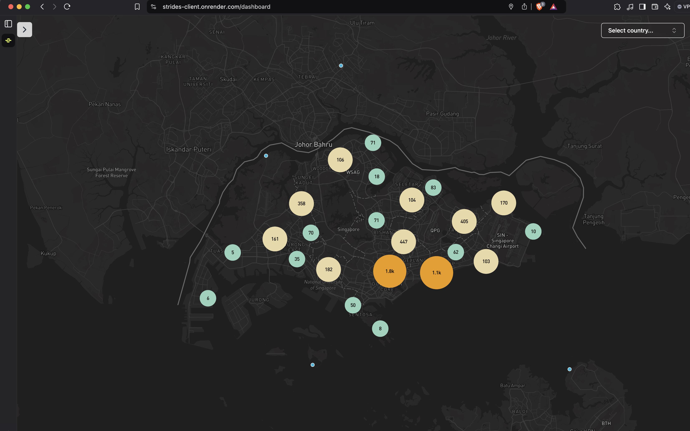
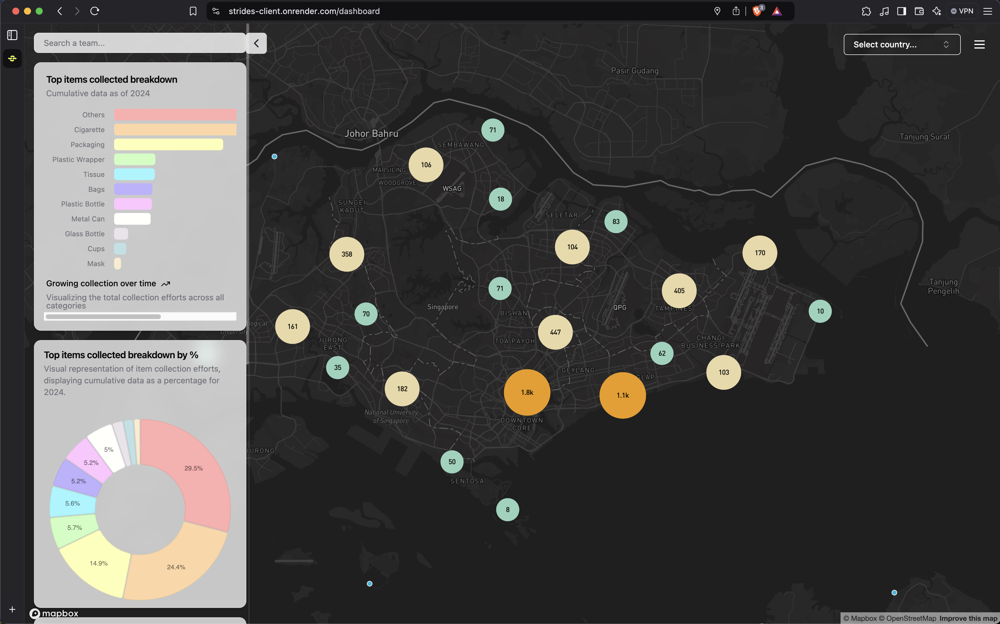
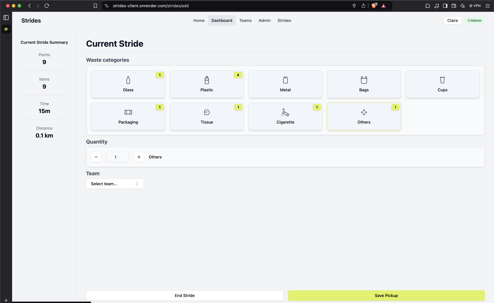

  

  <h3 align="center">Stridy MVP</h3>

  

    Stridy is a platform that helps individuals and teams <b>track their environmental contributions<> by measuring the waste they collect during cleanup activities.  
     
    <a href="https://github.com/pytest5/strides"><strong>Explore the docs »</strong></a>
     
     
    <a href="https://github.com/othneildrew/Best-README-Template">View Demo</a>
    &middot;
    <a href="https://github.com/pytest5/strides/issues/new?template=Blank+issue">Report Bug</a>
    &middot;
    <a href="https://github.com/pytest5/strides/issues/new?labels=enhancement&template=feature-request---">Request Feature</a>
  

# Stridy MVP

**Stridy MVP** is a platform designed to help individuals and teams **track, visualize, and optimize their environmental impact**. It enables users to log waste collection activities (strides), track progress through interactive maps, and analyze contributions over time via leaderboards and analytics.

This platform was originally built as an **MVP for a non-profit organization** to explore how data visualization and tracking can empower environmental efforts. Following the MVP, the organization engaged a full-stack developer to further enhance their platform.

## Features

- **User Authentication**: Users can sign up and log in to track their individual strides.
- **Team Leaderboards**: Track and compare strides across teams to encourage collaboration and competition.
- **Geospatial Visualization**: View strides on an interactive map with Mapbox, showing the quantity and type of waste collected.
- **Admin Dashboard**: Admins can manage users, teams, and stride data.
- **Analytics**: View charts and graphs to see the breakdown of collected items over time.

## Screenshots

### Landing Page

### Strides Map

### Data visualization

### Strides Input Form

## Tech Stack

### Frontend

- **React**: UI Framework
- **Tailwind CSS**: For styling and UI design
- **React Hook Form**: For form handling and validation
- **Zod**: Schema validation
- **React Query**: For data fetching and caching
- **Mapbox GL**: For geospatial map visualization
- **Radix UI**: Accessible UI components

### Backend

- **Node.js**: JavaScript runtime
- **Express.js**: Backend framework
- **PostgreSQL**: Relational database for storing user and strides data
- **JWT**: Authentication using JSON Web Tokens
- **bcrypt**: For password hashing
- **pg**: PostgreSQL client for Node.js

## Installation and Setup

### Deployment details

- **Frontend**: Deployed as a static site on Render
- **Backend**: Deployed as a Node.js service on Render
- **Database**: PostgreSQL hosted on Render with automated backups

### Prerequisites

- Node.js and npm installed
- PostgreSQL installed and running
- Mapbox API Key (for geospatial data visualization)

### Usage

- Adding Strides: Users can log their strides, including the types of waste collected, distance, and time.
- Viewing Strides: All collected data is displayed on a map, with the ability to filter by date, team, and location.
- Managing Data: Admins can view and manage all user data, teams, and strides.
